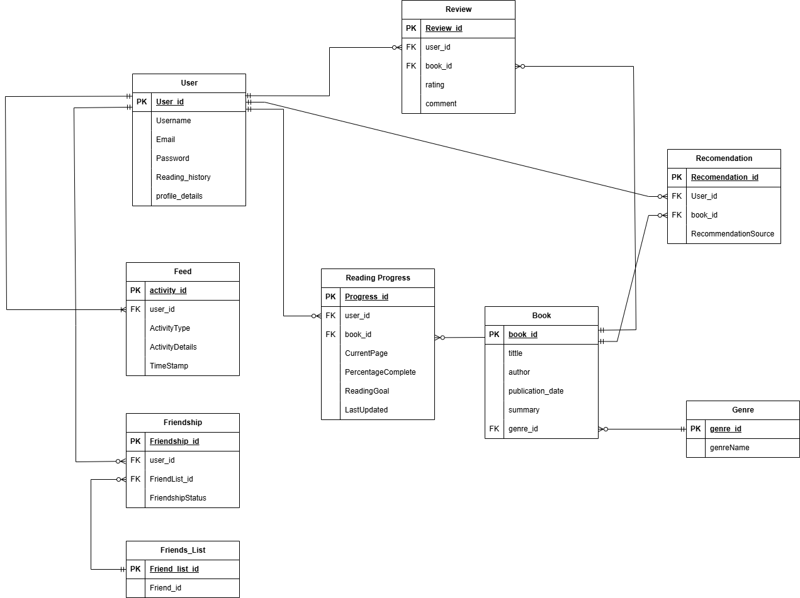

# The Book Application

The Book Application is a platform that allows users to save and post information about their favorite books, rate them, and track their reading progress. The app also includes a social feature that enables users to recommend books to one another and see others progress.


## Features

### 1. **Account Creation and Authentication**
   - Users can sign up using their email address, choosing a unique username and password.
   - Passwords are securely hashed before storage.
   - Users can log in using their credentials, and a JWT (JSON Web Token) is issued for authenticated sessions.

### 2. **Book Rating**
   - Users can rate books they have read on a scale of 1 to 5 stars.
   - Ratings are stored and can be updated or deleted by the user.

### 3. **Reading Progress Tracker**
   - Users can update their reading progress for a specific book by marking chapters or page numbers.
   - Users can set reading goals or deadlines and track their progress over time.
   - Progress data is visualized to help users stay on track.

### 4. **Social Recommendations**
   - Users can recommend books to other users.
   - Recommendations include a personal message and are stored in the recipient’s account.

---

## Entities

### 1. **User**
   - `id`: Unique identifier for the user.
   - `username`: Unique username chosen by the user.
   - `email`: User’s email address.
   - `password`: Hashed password for authentication.
   - `createdAt`: Timestamp for account creation.

### 2. **Book**
   - `id`: Unique identifier for the book.
   - `title`: Title of the book.
   - `author`: Author of the book.
   - `genre`: Genre of the book.
   - `description`: Brief description of the book.

### 3. **Rating**
   - `id`: Unique identifier for the rating.
   - `userId`: ID of the user who rated the book.
   - `bookId`: ID of the book being rated.
   - `rating`: Rating value (1-5 stars).
   - `createdAt`: Timestamp for when the rating was created.

### 4. **Reading Progress**
   - `id`: Unique identifier for the progress entry.
   - `userId`: ID of the user tracking progress.
   - `bookId`: ID of the book being tracked.
   - `currentPage`: Current page number the user is on.
   - `currentChapter`: Current chapter the user is on.
   - `goal`: Reading goal or deadline (optional).
   - `updatedAt`: Timestamp for the last progress update.

### 5. **Recommendation**
   - `id`: Unique identifier for the recommendation.
   - `senderId`: ID of the user sending the recommendation.
   - `receiverId`: ID of the user receiving the recommendation.
   - `bookId`: ID of the book being recommended.
   - `message`: Personal message from the sender.
   - `createdAt`: Timestamp for when the recommendation was sent.

# Installation Instructions

Follow these steps to install and run **The Book Application** on your  server.

---

## Prerequisites

Before you begin, ensure you have the following installed:

- **Node.js** (v16 or higher)
- **npm** (Node Package Manager) 
- **MongoDB** (or access to a MongoDB instance)
- **Git** (optional, for cloning the repository)

---

## Step 1: Clone the Repository

1. Open your terminal.
2. Run the following command to clone the repository:
  ```bash
   git clone https://github.com/your-username/book-app.git
   ```

## Step 2: Install Dependencies 
```bash
npm install
```

## Step 3: Set up .env
```bash
PORT=5000
MONGO_URI=mongodb://localhost:27017/bookapp
JWT_SECRET_KEY=secretValueForBookApp
```
## Step2: Run application 
```bash
npm start
```

## ERD


## Relevance of Hardware and Software Technologies to The Book Application
**Hardware Technologies:**

1. **Cloud Servers (e.g., AWS, Google Cloud):**

- **Relevance**: The Book Application requires a reliable and scalable infrastructure to handle user data, book information, and social interactions (e.g., recommendations). Cloud servers provide the necessary scalability and reliability.

- **Impact**: Ensures the application can handle increasing numbers of users and data without downtime or performance degradation.

**Database Storage** (e.g., SSDs):

- **Relevance**: Fast read/write operations are essential for retrieving book details, user ratings, and reading progress efficiently.

- **Impact:** Improves the user experience by reducing loading times and ensuring smooth interactions.

**User Devices** (e.g., desktops, smartphones, tablets):

- **Relevance**: The application must be accessible across multiple devices to cater to a wide range of users.

- **Impact**: Ensures inclusivity and accessibility, allowing users to interact with the app on their preferred devices.

## Evaluation of Hardware Technologies in The Book Application
1. **Cloud Servers**: 

- **Effectiveness**: Cloud servers like AWS or Google Cloud provide high availability and scalability, ensuring the application can handle peak traffic (e.g., during book launches or promotions).

- **Impact**: Users experience minimal downtime, and the application remains responsive even under heavy load.

**2. Database Storage (SSDs):**

- **Effectiveness**: SSDs enable fast data retrieval, which is critical for features like displaying book details, user ratings, and reading progress.

- **Impact**: Users enjoy quick access to information, enhancing their overall experience.

**User Devices:**

- **Effectiveness:** The application is designed to be responsive and compatible with desktops, smartphones, and tablets.

-**Impact**: Users can access the app from any device, increasing engagement and usability

## Evaluation of Software Technologies
1. **JavaScript (Node.js and React):**

- **Effectiveness**: Using JavaScript for both backend and frontend development streamlines the development process and ensures consistency across the application.

- **Impact**: Reduces development time and simplifies debugging and maintenance.

2.**MongoDB**:

- **Effectiveness**: MongoDB’s flexible schema allows for easy storage and retrieval of diverse data types, such as user profiles, book details, and reading progress.

- **Impact**: Simplifies database management and supports scalability as the application grows.

3.**JWT for Authentication:**

-**Effectiveness**: JWT provides a secure and stateless method for user authentication, ensuring that only authorized users can access sensitive features.

-**Impact**: Enhances security and builds user trust in the application.

4.**RESTful APIs:**

- **Effectiveness**: RESTful APIs enable seamless communication between the frontend and backend, allowing features like fetching book details, submitting ratings, and sending recommendations to work smoothly.

- **Impact**: Ensures a cohesive and integrated user experience.


## Programming Style
This project will be implementing the Javascript style for all program code. The following rules will be followed in all code for this project:

- Variable and function names will use camelCase. 
- Global variables if used written in uppercase.
- Spaces will be around all operators (= + - * /) and after commas
- End all simple statements with a semicolon.

**Reference** - https://www.w3schools.com/JS/js_conventions.asp


GitHub repo: https://github.com/earvin-tech/Book_Application

## Collaborators
- [Tamika Short](https://github.com/tshort11)
- [Earvin Tumpao](https://github.com/earvin-tech)
- [Hammad Nasir](https://github.com/h4mm4)