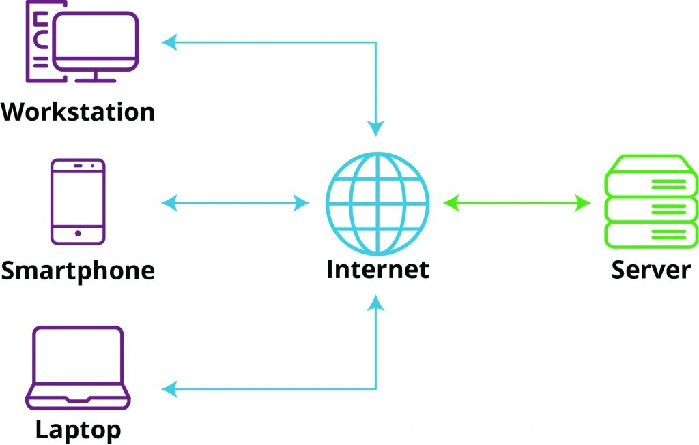
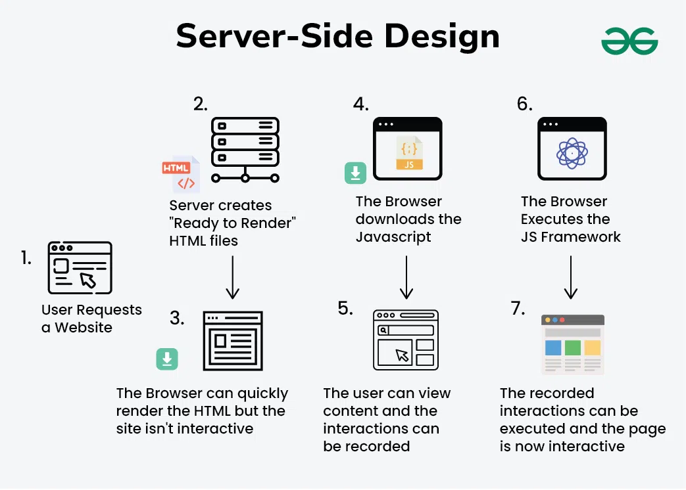

## Explanation of how client/server architecture works

With the client/server architecture, the system is dived into two components of the front-end; the client that is the user-facing application e.g mobile app, web app or desktop app. These will then send requests to the server. 

The server is the back-end that processes the requests and data that then sends the information back to the client.  

This client/server relationship communicate over a network such as the internet using protocols like http/https.

  

 
 Client Server Architecture Diagram

## How it will work in our system 

1. ### Client (Frontend) 

The client is the application that users interact with. It could be: 

- A mobile app which will be the main focus (e.g., iOS or Android). 

- A web app (e.g., accessed through a browser). 

- A desktop app. 

The client handles: 

- User Interface (UI): Displays book information, reviews, reading progress, recommendations, and activity feeds. 

- User Input: Collects data from users (e.g., ratings, reviews, reading progress updates). 

- Sending Requests: Sends requests to the server for data or processing (e.g., "Show progress for Book X" or "Submit a review for Book Y"). 

 

2. ### Server (Backend) 

The server is the backend system that manages: 

- **Data Storage**: Stores all data in a database (e.g., user information, book details, reviews, reading progress, recommendations). 

- **Business Logic**: Processes requests from the client (e.g., calculating recommendations, updating reading progress, or generating activity feeds). 

- **Authentication**: Verifies user credentials (e.g., during login or account creation). 

- **APIs**: Exposes endpoints for the client to interact with (e.g., /login, /books, /reviews, /progress). 

 

## How Client and Server Interact 

**Step-by-Step Example: User Submits a Review**

1. **Client (Frontend)**: 

a. The user writes a review for a book and clicks "Submit." 

b. The client collects the review data (e.g., rating, comment, book ID, user ID). 

c. The client sends an `HTTP POST request` to the server (e.g., to the /reviews endpoint). 

2. **Server (Backend)**: 

a. The server receives the request and validates the data (e.g., checks if the user and book exist). 

b. The server processes the request by saving the review to the database (e.g., in the Review table). 

c. The server updates related data (e.g., recalculates the book’s average rating). 

d. The server sends a **response** back to the client (e.g., "Review submitted successfully"). 

3. **Client (Frontend)**: 

a. The client receives the response and updates the UI (e.g., displays a success message and shows the new review). 

 

**Another Example: User Views Their Reading Progress**

1. **Client (Frontend):**

a. The user navigates to their reading progress page. 

b. The client sends an `HTTP GET request to the server` (e.g., to the /progress endpoint with the user ID). 

2. **Server (Backend):** 

a. The server retrieves the user’s reading progress data from the database (e.g., from the `ReadingProgress` table). 

b. The server sends the data back to the client in a structured format. 

3. **Client (Frontend):** 

a. the client receives the data and displays it in the UI (e.g., shows a progress bar or list of books being read). 

 

## Key Components of Client/Server Architecture in Your System ##

1. **Database**

Stores all the entities and relationships defined in your ERD: 

- `User`, `Book`, `Review`, `ReadingProgress`, `Recommendation`, `Friendship`, `Category/Genre`, `ActivityFeed`. 

- Managed by the server, which reads from and writes to the database. 

2. **APIs (Application Programming Interfaces)**

- The server exposes APIs for the client to interact with. Examples: 

    - **Account Creation & Authentication:** 

        - `POST`/ signup (create a new user). 

        - `POST` / login  (authenticate a user). 

    - **Book Rating System:** 

        - `POST` /reviews (submit a review). 

        - `GET` /reviews (fetch reviews for a book). 

    - **Reading Progress Tracker:**

        - `POST` /progress (update reading progress). 

        - `GET` /progress (fetch reading progress). 

    - **Recommendations:** 

        - `GET` /recommendations (fetch personalized book recommendations). 

    - **Social Features:** 

        - `POST` /friends (follow a user). 

        - `GET` /activity (fetch activity feed). 

3. **Network Communication**

- The client and server communicate over the internet using `HTTP/HTTPS`. 

- Data is typically exchanged in JSON format (e.g., for reviews, progress updates, recommendations). 

 

Client Server Architecture - System Desgin

 
**Benefits of Client/Server Architecture**

1. **Scalability:** 

a. The server can handle multiple clients simultaneously (e.g., thousands of users accessing the app). 

2. **Centralized Data Management:** 

a. All data is stored and managed on the server, ensuring consistency and security. 

3. **Separation of Concerns:**

a. The client focuses on the UI and user experience, while the server handles data processing and storage. 

4. **Security:** 

a. Sensitive data (e.g., passwords) is stored on the server, not the client. 

b. Authentication and authorization are managed by the server. 