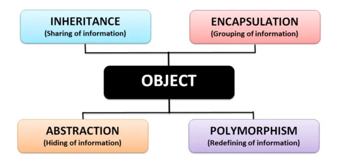
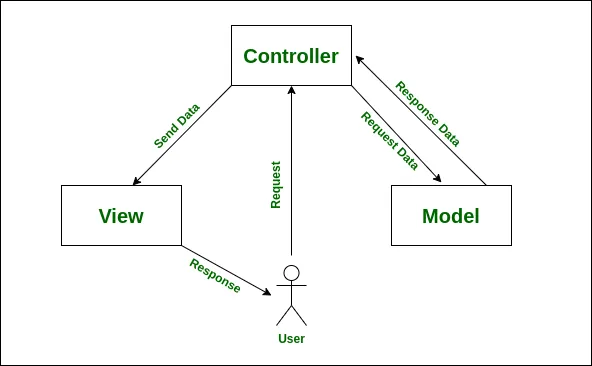
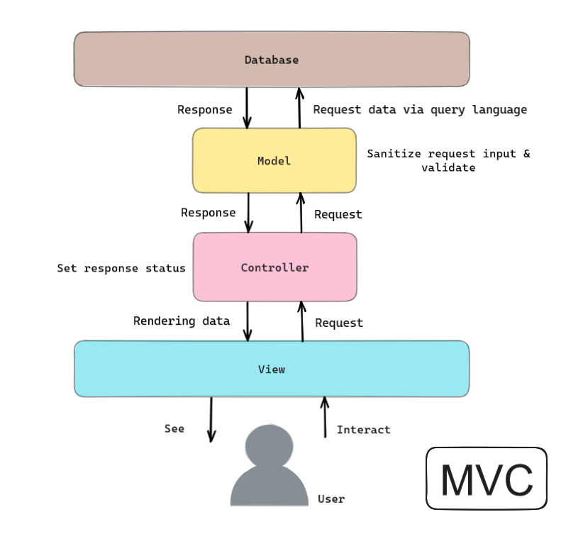

## **Programming Paradigm - Object Oriented Programming**
For this application we have opted to use Object Oriented Programming. Object oriented programming or OOP is a programming paradigm in which real world things are represented as objects in code. These objects consist of two things: attributes and methods. 

Using a real world example, let us represent a bank account. So a bank account's attributes would be what make a bank account, it needs to have an account number, balance, maybe an account type, like checking or savings. A method would be a process that this object, the bank account performs such as depositing, withdrawing, showing balance. 

```py
class Account:
    # Initialising the parameters of the class
    def __init__(self, account_type, id, balance=0.0): 
        # 'checking', 'savings', etc.
        self.account_type = account_type  
        # Balance of the account
        self.balance = balance 
        # Account ID
        self.id = id 
        # Determines rates for checking and savings accounts
        self.rate = 1.03 if account_type == 'checking' else 1.05 

    def deposit(self, amount): 
        # Checks for valid deposit amount, must be positive
        if amount > 0:  
            # Adds input to current balance
            self.balance += amount 
        else:
            # Prints if not valid
            print(f"{error_color}Deposit amount must be positive.{reset}")
```

_Example of bank account object in Python._

In the above image it shows a bank account represented as a blueprint of an object. Without going into too much detail, it simply contains attributes such as account type, balance, and id. It's methods it can perform are deposit and withdraw. All actions a bank account performs in the real world are represented as an object in code.

### **Four pillars of OOP**

So as stated before objects in real life are represented in code such as the previous example above with the bank account. The representations of the object in code that outline the attributes and methods are called 'classes'. Classes are the blueprint of the object. Classes allow us to create 'instances' which are the objects created from the blueprint classes.

There are four pillars of writing OOP code we always must keep in mind:

1. Encapsulation
2. Abstraction
3. Inheritance
4. Polymorphism



#### <ins>**Encapsulation**</ins>

The principle of encapsulation states that objects should not be accessed or manipulated directly but through methods built into the object class. This is to avoid unwanted data manipulation, hence for safety we allow only methods in the object's class to manipulate the data. Methods that are used to access data are called 'getters' and methods used to manipulate data are called 'getters'.

```js
class LoginAccount {
    constructor(username, password) {
        this._username = username // Private property using underscore 
        this._password = password
    }

    getUsername() {
        return this._username
    }

    getPassword() {
        return this._password
    }

    changePassword(change) {
        this._password = change
    }
}

// Create a Login Account object
const newAccount = new LoginAccount("username1", "secret_password25")

// Accessing properties through getter methods
console.log(newAccount.getUsername()) // Outputs: username1
console.log(newAccount.getPassword()) // Outputs: secret_password25

// Using setter methods to change properties
newAccount.changePassword("new_password")
console.log(newAccount.getPassword()) // Outputs: new_password
```

In the example show above we have a class LoginAcount which has private properties 'username' and 'password'. These properties are accessed using the methods defined in the class.

#### <ins>**Abstraction**</ins>

Abstraction states that only necessary information is shown to a user. Only information that is specifically requested should be exposed and the complex details are hidden. 

Take for example a car, a function we can look at is starting the engine when you turn the key, you know that turning the key starts the engine, however you do not need to know about the complex parts of the car that work to start the engine. Or when you use a 'print' function or 'console.log' function you only know that the text will be displayed on the console but you do not know the functionality details of the functions.

Let us take a look at a basic example of abstraction using the force function [F = ma]

```js
function ForceCalculate(mass, acceleration) {
    return mass * acceleration // The logic of the function is hidden
}

console.log(ForceCalculate(30, 9.81)) // Outputs: 294.3 
```

Here the formula of the function is not shown only the result of it is. This is abstraction in a function object.

#### <ins>**Inheritance**</ins>
Inheritance is where a class can 'inherit' or take on the attributes and methods of another class. A class that inherits from another is called a 'child' class of the 'parent' class that it inherits from. 

Let us say we have a range of vehicles, so we create a class called 'vehicles'. However, there are different types of vehicles such as buses, cars, bicycles. These vehicles are their own class but inherit attributes and/or methods. Cars, buses, and bicycles would inherit an attribute 'wheels' for example since all these vehicles have wheels.

Let us look at a coded example below:

```js
// parent class
class Person { 
    constructor(name) {
        this.name = name;
    }

    greet() {
        console.log(`Hello ${this.name}!`);
    }
}

// inheriting parent class
class Student extends Person { // extends keyword denotes that the new Student class is inheriting from the Person class

    constructor(name) {
        // call the super class constructor and pass in the name parameter
        super(name);
    }
}

const student1 = new Student('Earvin');
student1.greet(); // Outputs: Hello Earvin
```
In the above example the Student class does not need to redefine the greet function as it inherits the function from the person class. Inheritance allows reusability of code for child classes.

#### <ins>**Polymorphism**</ins>

Polymorphism simply means "having many forms", so in the context of programming it means an object being able to have different characteristics and functions. When a class inherits methods from a parent class the methods of the child class can be the same as the parent class but also be changed to suit different situations. One way to do this is through method overriding. Method overriding is when the child class implements it's own functionality over the parent class' method.

Let's look at an example:

```js
class Animal {
    speak() {
      console.log("This animal makes a sound.");
    }
  }
  
  class Dog extends Animal {
    speak() {
      console.log("The dog barks."); // override the speak() function of Animal parent class
    }
  }
  
  class Cat extends Animal {
    speak() {
      console.log("The cat meows."); // override the speak() function of Animal parent class
    }
  }
  
  const animals = [new Animal(), new Dog(), new Cat()];
  
  animals.forEach(animal => animal.speak());
```

We see in this example the Dog and Cat child classes redefine the function of the same name, speak() from their parent class Animal.


## **App Architecture - MVC**

The software architecture we have opted to use for this project is MVC - Model View Controller. 

MVC separates an application into three components; the model, the view, and the controller. The model represents the data and business logic, the view is responsible for presentation of the data to the user, and the controller is the middleman between the view and model, it updates the model according to input from the view but also does the opposite, updating the view to reflect changes in the model.



Diagram of how MVC works within an application.

### Model

Additionally from representing the data a model will also be responsible for sanitizing and validating data. When a request is sent to the model from the controller if it is requesting to fetch data the model will request this data using a query language (we will be using mongodb) from the database the application is connected to. 

### View

### Controller



How data flows from Database to user and vice-versa via MVC.

## **Advantages of MVC**

- Codes are easy to maintain and they can be extended easily.
- The MVC model component can be tested separately.
- The components of MVC can be developed simultaneously.
- It reduces complexity by dividing an application into three units. Model, view, and controller.
- It supports Test Driven Development (TDD).
- It works well for Web apps that are supported by large teams of web designers and developers.
- This architecture helps to test components independently as all classes and objects are independent of each other

## References 
- https://levelup.gitconnected.com/principles-of-object-oriented-programming-33a08094afe6
- https://medium.com/@tayfunkalayci/abstraction-in-software-exploring-real-world-examples-b2e95d496bef#:~:text=One%20of%20the%20most%20prevalent,creating%20instances%20known%20as%20objects.
- https://logicmojo.com/inheritance-in-oops#:~:text=Inheritance%20is%20a%20technique%20of,are%20all%20utilised%20for%20transportation.
- https://medium.com/@kerimkkara/understanding-mvc-model-view-controller-with-c-and-net-5197bbbc7ed5
- https://www.geeksforgeeks.org/polymorphism-in-javascript/
- https://www.tutorialspoint.com/mvc_framework/mvc_framework_introduction.htm#:~:text=The%20Model%2DView%2DController%20,development%20aspects%20of%20an%20application.
- https://www.interviewbit.com/blog/mvc-architecture/ 