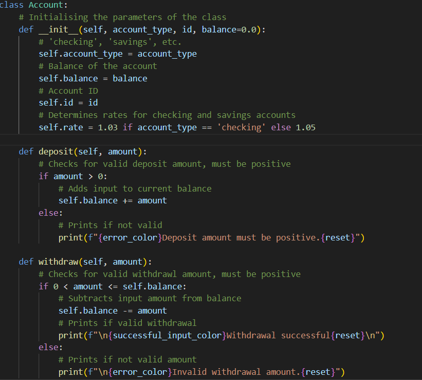

## **Programming Paradigm - Object Oriented Programming**
For this application we have opted to use Object Oriented Programming. Object oriented programming or OOP is a programming paradigm in which real world things are represented as objects in code. These objects consist of two things: attributes and methods. 

Using a real world example, let us represent a bank account. So a bank account's attributes would be what make a bank account, it needs to have an account number, balance, maybe an account type, like checking or savings. A method would be a process that this object, the bank account performs such as depositing, withdrawing, showing balance. 

_Example of bank account object in Python._

In the above image it shows a bank account represented as a blueprint of an object. Without going into too much detail, it simply contains attributes such as account type, balance, and id. It's methods it can perform are deposit and withdraw. All actions a bank account performs in the real world are represented as an object in code.

### **Four pillars of OOP**

So as stated before objects in real life are represented in code such as the previous example above with the bank account. The representations of the object in code that outline the attributes and methods are called 'classes'. Classes are the blueprint of the object. Classes allow us to create 'instances' which are the objects created from the blueprint classes.

There are four pillars of writing OOP code we always must keep in mind:

1. Encapsulation
2. Abstraction
3. Inheritance
4. Polymorphism

#### <ins>**Encapsulation**</ins>

The principle of encapsulation states that objects should not be accessed or manipulated directly but through methods built into the object class. This is to avoid unwanted data manipulation, hence for safety we allow only methods in the object's class to manipulate the data. Methods that are used to access data are called 'getters' and methods used to manipulate data are called 'getters'.

#### <ins>**Abstraction**</ins>

Abstraction states that only necessary information is shown to a user. Only information that is specifically requested should be exposed.

#### <ins>**Inheritance**</ins>
Inheritance is where a class can 'inherit' or take on the attributes and methods of another class. A class that inherits from another is called a 'child' class of the 'parent' class that it inherits from.

#### <ins>**Polymorphism**</ins>

Polymorphism simply means "having many forms", so in the context of programming it means an object being able to have different characteristics and functions. When a class inherits methods from a parent class the methods of the child class can be the same as the parent class but also be changed to suit different situations.

## **App Architecture - MVC**

The software architecture we have opted to use for this project is MVC - Model View Controller. 

MVC separates an application into three components; the model, the view, and the controller. The model represents the data and business logic, the view is responsible for presentation of the data to the user, and the controller is the middleman between the view and model, it updates the model according to input from the view but also does the opposite, updating the view to reflect changes in the model.

Diagram of how MVC works.